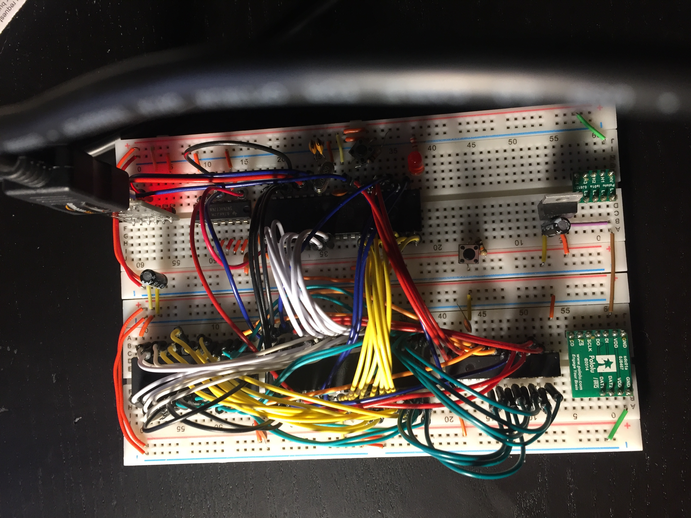
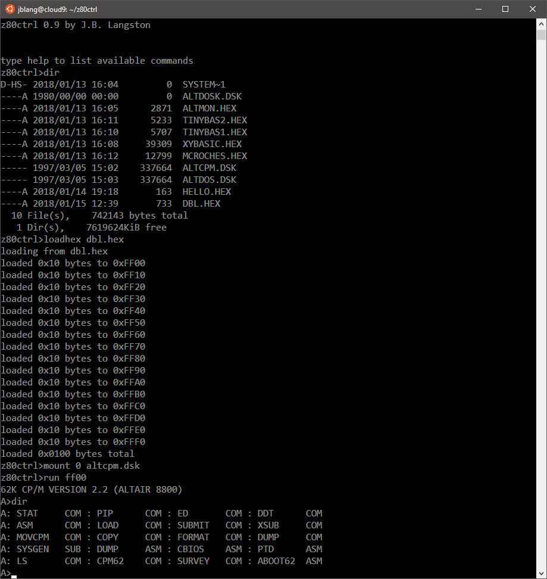

# z80ctrl

This is an AVR-based bootloader and I/O firmware for a Z80 single-board computer.  The AVR loads an external SRAM with code for the Z80 to run. Once the Z80 is running, AVR also provides debugging facilities, serial I/O, disk emulation, and potentially other peripherals for the Z80.  [Several](https://hackaday.io/project/7354-zaviour-board-avrz80-hybrid) [other](http://benryves.com/journal/3662496) [people](https://www.apress.com/us/book/9781484214268) have had the idea to combine an AVR with a Z80 before me, but have shared very little of the code necessary for others to build a fully-functioning SBC. I aim to change that with this project. I have taken inspiration from these projects but I designed this specific circuit and software implementation myself.  My implementation also introduces several innovations not present in previous projects. These are described in the design notes section below.

## Hardware

### Bill of Materials

- Zilog [Z84C010PEG](http://www.mouser.com/ds/2/450/ps0178-19386.pdf) 10MHz Z80 CPU
- Alliance [AS6C4008](http://www.mouser.com/ds/2/12/AS6C4008-1265427.pdf) 512KB SRAM chip
- Atmel [ATmega1284p](http://ww1.microchip.com/downloads/en/DeviceDoc/Atmel-42719-ATmega1284P_Datasheet.pdf) AVR microcontroller
- Microchip [MCP23S18](http://ww1.microchip.com/downloads/en/DeviceDoc/22103a.pdf) SPI I/O expander
- [74HCT74](http://www.ti.com/general/docs/lit/getliterature.tsp?genericPartNumber=SN74HCT74&fileType=pdf) dual D-type flip-flop
- [LM1117](http://www.ti.com/lit/ds/symlink/lm1117.pdf) 3.3V regulator
- Silicon Labs [CP2102](https://www.silabs.com/documents/public/data-sheets/CP2102-9.pdf) USB-to-TTL serial breakout
- Pololu [ls01a](https://www.pololu.com/product/2595) 4 channel level shifter
- Pololu [sdc01a](https://www.pololu.com/product/2597) microSD breakout
- 20MHz crystal with 20 pf load caps for AVR
- Various 0.01uf bypass and 10uf filter caps

### Connections

The prototype has been built on two full-size breadboards using dupont wire.  In lieu of a schematic for now, here is a table of connections. Pin names are followed by pin numbers are in parentheses.  Please refer to notes after each table for connections marked with an asterisk.

#### Memory, Address, and Control Busses

| Z80          | 74HCT74    | Atmega1284P | MCP23S18    | AS6C4008 | Power |
|--------------|------------|-------------|-------------|----------|-------|
| A0 (30)      |            | PA0 (40)    |             | A0 (12)  |       |
| A1 (31)      |            | PA1 (39)    |             | A1 (11)  |       |
| A2 (32)      |            | PA2 (38)    |             | A2 (10)  |       |
| A3 (33)      |            | PA3 (37)    |             | A3 (9)   |       |
| A4 (34)      |            | PA4 (36)    |             | A4 (8)   |       |
| A5 (35)      |            | PA5 (35)    |             | A5 (7)   |       |
| A6 (36)      |            | PA6 (34)    |             | A6 (6)   |       |
| A7 (37)      |            | PA7 (33)    |             | A7 (5)   |       |
| A8 (38)      |            |             | GPA0 (20)   | A8 (27)  |       |
| A9 (39)      |            |             | GPA1 (21)   | A9 (26)  |       |
| A10 (40)     |            |             | GPA2 (22)   | A10 (23) |       |
| A11 (1)      |            |             | GPA3 (23)   | A11 (25) |       |
| A12 (2)      |            |             | GPA4 (24)   | A12 (4)  |       |
| A13 (3)      |            |             | GPA5 (25)   | A13 (28) |       |
| A14 (4)      |            |             | GPA6 (26)   | A14 (3)  |       |
| A15 (5)      |            |             | GPA7 (27)   | A15 (31) |       |
|              |            |             | GPB5 (8)    | A16 (2)  |       |
|              |            |             | GPB6 (9)    | A17 (30) |       |
|              |            |             | GPB7 (10)   | A18 (1)  |       |
| D0 (14)      |            | PC0 (22)    |             | DQ0 (13) |       |
| D1 (15)      |            | PC1 (23)    |             | DQ1 (14) |       |
| D2 (12)      |            | PC2 (24)    |             | DQ2 (15) |       |
| D3 (8)       |            | PC3 (25)    |             | DQ3 (17) |       |
| D4 (7)       |            | PC4 (26)    |             | DQ4 (18) |       |
| D5 (9)       |            | PC5 (27)    |             | DQ5 (19) |       |
| D6 (10)      |            | PC6 (28)    |             | DQ6 (20) |       |
| D7 (13)      |            | PC7 (29)    |             | DQ7 (21) |       |
| M1# (27)     |            | PB1 (2)     |             |          |       |
| MREQ# (19)   |            | PD3 (17)    |             | CE# (22) |       |
| IORQ# (20)   | 1PRE# (4)  | PD2 (16)    |             |          |       |
| RD# (21)     |            | PD5 (19)    |             | OE# (24) |       |
| WR# (22)     |            | PD4 (18)    |             | WE# (29) |       |
| RFSH# (28)   |            |             |             |          |       |
| HALT# (18)*  |            | PB2 (3)*    |             |          | GND*  |
| WAIT# (24)   | 1Q# (6)    |             |             |          |       |
| INT# (16)    |            |             | GPB0 (3)    |          |       |
| NMI# (17)    |            |             | GPB1 (4)    |          |       |
| RESET# (26)  |            |             | GPB2 (5)    |          |       |
| BUSREQ# (25) |            |             | GPB3 (6)    |          |       |
| BUSACK# (23) |            |             | GPB4 (7)    |          |       |
| CLK (6)      |            | PD6 (20)    |             |          |       |
|              | 1CLR# (1)  | PD7 (21)    |             |          |       |
|              | 1D (2)     |             |             |          | GND   |
|              | 1CLK (3)   |             |             |          | GND   |
|              | 2CLR# (13) |             |             |          | 5V    |
|              | 2D (12)    |             |             |          | 5V    |
|              | 2CLK (11)  |             |             |          | 5V    |
|              | 2PRE# (12) |             |             |          | 5V    |
|              |            | PB4 (5)     | CS# (12)    |          |       |
|              |            |             | RESET# (16) |          | 5V    |
|              |            | SCK (8)     | SCK (13)    |          |       |
|              |            | MISO (7)    | SO (15)     |          |       |
|              |            | MOSI (6)    | SI (14)     |          |       |
|              |            | PB3 (4)     |             |          |       |
|              |            | XTAL1 (13)* |             |          |       |
|              |            | XTAL2 (12)* |             |          |       |
| +5V (11)     | VCC (14)   | VCC (10)    | VDD (11)    | VCC (32) | 5V*   |
| GND (29)     | GND (7)    | GND (11)    | VSS (1)     | VSS (16) | GND*  |

Notes:
1. HALT# connected to PB6 through a diode: `PB6 ->|- HALT#`. PB6 is also connected through a momentary push button to ground.
2. Atmega1284p XTAL1 and XTAL2 connected to 20MHz full swing crystal oscillator with 20 pf load capacitors to GND on each pin.
3. Each chip has a 0.1uf bypass capacitor from 5V to GND.

#### SD Card

| Atmega1284p | LS01A   | SDC01A   | LM1117T-3.3V | Power |
|-------------|---------|----------|--------------|-------|
| SCK (8)     | H1 (2)  |          |              |       |
| MISO (7)    | H2 (3)  |          |              |       |
| MOSI (6)    | H3 (4)  |          |              |       |
| PB3 (4)     | H4 (5)  |          |              |       |
|             | L1 (9)  | SCLK (5) |              |       |
|             | L2 (8)  | DO (4)   |              |       |
|             | L3 (7)  | DI (3)   |              |       |
|             | L4 (6)  | CS# (6)  |              |       |
| VCC (10)    | HV (1)  |          | INPUT*       | 5V    |
|             | LV (10) | VDD (2)  | OUTPUT*      | 3V    |
| GND (11)    |         | GND (1)  | GND*         | GND   |

Note: Input and output pins of LM117T-3.3V each have 10uf filter capacitor to GND.

#### Serial Adapter

| ATmega1284p | CP2102 | Power    |
|-------------|--------|----------|
| RESET# (9)* | DTR*   | 5V, GND* |
| RXD0 (14)   | TXO    |          |
| TXD0 (15)   | RXI    |          |
| VCC (10)    | VCC    | 5V       |
| GND (11)    | GND    | GND      |

Note: RESET# is connected to DTR through a 0.1uf capacitor: `RESET# -||- DTR`. RESET# is also connected through a 10K pullup resistor to 5V and through a momentary push button to GND.

### Design Notes

The ATmega1284p doesn't have enough I/O to interface with all of the Z80's bus lines, so I used an I/O expander to provide two additional 8-bit I/O ports.  I have tried to optimize performance by connecting the most freqently-changed signals directly to the AVR, and connecting those less-frequently changed are on the I/O expander.  The AVR has direct connections for the LSB of the address bus, the data bus, and following control lines: MREQ, IORQ, RD, WR, M1 and HALT.  

The MSB of the address bus, the 3-bit bank address for the 512K SRAM, and the remaining control lines--INT, NMI, RESET, BUSRQ, and BUSACK--are on the I/O expander. This arrangement allows the AVR to do faster DMA than would be possible if the entire address bus were on the I/O expander. With just the upper 8 bits of the address on the expander, the AVR only has to use the slower SPI interface to change the MSB of the address bus once every 256 bytes of memory instead of for every byte. 

The AVR produces a 10MHz clock signal for the Z80 using hardware PWM. However, care must be taken to avoid bus contention when switching the bus directions.  Therefore, the AVR brings the clock under software control to perform cycle-exact timing when responding to I/O requests. Software control of the clock also allows the bus state to be traced for each clock cycle if desired.  Under software control, the clock can achieve a maximum frequency of about 4MHz. When tracing information is being logged, the attainable clock rate slows down to several hundred KHz.

Because the AVR cannot respond to an I/O request quickly enough to satisfy the timing demands of the Z80, the IORQ line also sets a flip-flop that asserts the WAIT line on the Z80 to add wait states until the AVR can respond.  The AVR polls the IORQ line in a tight loop and services the request when IORQ goes low. When the AVR has finished servicing the I/O request, it brings the reset line on the flip-flop low to deassert the WAIT line on the Z80.  It then manually clocks the Z80 until the IORQ line goes high. At this point, it ensures that its data port is in input mode, releases the reset line on the flip flop, and restarts the PWM clock, allowing the Z80 to continue execution at full speed.

The HALT input on the AVR is connected to the Z80 through a diode so that it can also be grounded using a push button without shorting the halt pin on the Z80.  Thus, it is possible to return to the AVR-based monitor system automatically when the Z80 executes a halt instruction, or manually by pressing the halt button.  PB6 has the manual pullup resistor enabled so that the halt signal is high (inactive) when neither the HALT signal is asserted by the Z80 nor the button is pressed.

PB0 on the AVR is used as an output to flash an LED by the bootloader, so it cannot safely be connected to an output signal on the Z80.  By using PB0 as the chip select for the SD card, and connecting the LED from PB0 through a resistor to 5V, the bootloader LED doubles as a drive activity light, coming on when the SD chip select is low.

With the Z80 bus interface, UART RX/TX, SPI MISO/MOSI/SCK, and chip selects for the I/O expander and SD card, the AVR has 1 I/O pin left, which I currently have connected to the RFSH line for debugging purposes.  If needed in the future, it can be used for another chip select instead since the RFSH signal is only required for DRAM.  Alternatively the three available chip selects could be used as address lines for a 74HCT138 3-to-8-line decoder to provide chip selects for up to 8 SPI devices.

## Software

### AVR

The AVR is programmed with the [MightyCore](https://github.com/MCUdude/MightyCore) bootloader to allow it to be reprogrammed through the serial interface.  Although I am using the MightyCore bootloader, I do not use the Arduino libraries; only avr-libc. I use the [fatfs](http://elm-chan.org/fsw/ff/00index_e.html) library to provide access to a FAT32-formatted SD-card containing ROM and disk images for the Z80.

The layout of the source code is as follows:
- The specific ports and pins used for the Z80 bus interface and SPI chip selects are defined in `defines.h`.
- `bus.h` provides macros to set addresses and data values and read or toggle the various control lines. This abstracts away the low-level details required to control these pins, and allows the client code to be written solely in terms of Z80 I/O lines (e.g., RD_HI, RD_LO, GET_WR, BUSRQ_LO, GET_BUSACK, and so on). 
- Convenience functions are provided in `bus.c` to intialize the bus, enter and exit bus-master mode, do DMA transfers, reset and start the Z80, and trace the bus status during program execution.  Altair 8800 2SIO-compatible I/O ports for the Z80 are redirected to the UART on the AVR. 
- The `uart.c` and `uart.h` files borrowed from the avr-libc [stdio demo](http://www.nongnu.org/avr-libc/user-manual/group__stdiodemo.html) allow the use of the C stdio library over serial.
- `z80ctrl.c` contains the main function that presents a command-line monitor interface to allow programs to be loaded and run, memory to be inspected, and so forth. 
- `cli.c` contains the command-line interface for controlling the Z80 and memory via the AVR.

### Z80

Thus far, I have tested the following code on the Z80:
- I wrote a simple "hello, world" program in Z80 assembly language to test that the Z80 was able to successfully run code and use the serial I/O ports (`hello.asm`).  
- The first "real" software I got to run unmodified was [Turnkey Monitor](http://www.autometer.de/unix4fun/z80pack/ftp/altair/turnmon.asm) , a simple monitor program for the Altair 8800b (`turnmon.asm`). 
- I later discovered the more fully featured [Altair Monitor](http://altairclone.com/downloads/roms/Altair%20Monitor/) from the [Altair Clone](http://altairclone.com) project and switched to using it (`altmon.asm`).
- I have tried unsuccessfully to run Altair 4K BASIC. It starts to load (prompts for memory, terminal width, etc.) but then hangs before issuing the ready prompt. According to [one source](http://www.autometer.de/unix4fun/z80pack/ftp/altair/), 4K BASIC is not compatible with the Z80 so the problem may not be on my end. 

Once I implement bootloading and drive emulation using the SD Card, the ultimate goal is to get CP/M running.

I am cross-assembling the programs using [z80asm](http://www.nongnu.org/z80asm/) for Zilog mnemonics, or [asm8080](https://github.com/begoon/asm8080) for Intel mnemonics. After assembling the programs, I use `xxd -i` to generate a C header file with an array containing the machine code. Eventually this process will be replaced or supplemented by loading Z80 binary images from the SD card.

## License

Copyright 2018 J.B. Langston

Permission is hereby granted, free of charge, to any person obtaining a copy of this software and associated documentation files (the "Software"), to deal in the Software without restriction, including without limitation the rights to use, copy, modify, merge, publish, distribute, sublicense, and/or sell copies of the Software, and to permit persons to whom the Software is furnished to do so, subject to the following conditions:

The above copyright notice and this permission notice shall be included in all copies or substantial portions of the Software.

THE SOFTWARE IS PROVIDED "AS IS", WITHOUT WARRANTY OF ANY KIND, EXPRESS OR IMPLIED, INCLUDING BUT NOT LIMITED TO THE WARRANTIES OF MERCHANTABILITY, FITNESS FOR A PARTICULAR PURPOSE AND NONINFRINGEMENT. IN NO EVENT SHALL THE AUTHORS OR COPYRIGHT HOLDERS BE LIABLE FOR ANY CLAIM, DAMAGES OR OTHER LIABILITY, WHETHER IN AN ACTION OF CONTRACT, TORT OR OTHERWISE, ARISING FROM, OUT OF OR IN CONNECTION WITH THE SOFTWARE OR THE USE OR OTHER DEALINGS IN THE SOFTWARE.
