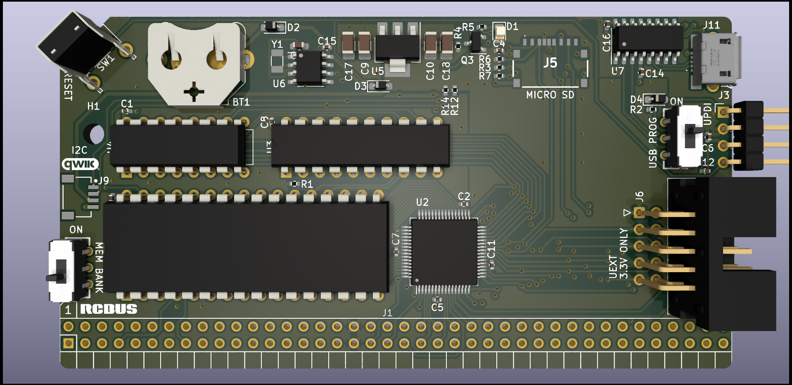

## z80ctrl NG

**Important: This design has not yet been tested.  Manufacture at your own risk.**

This is a new design for z80ctrl using the [Microchip AVR128DB64](https://www.microchip.com/en-us/product/avr128db64) microcontroller. 

This next-gen AVR has several advantages over the ATmega1284P used in the original design:

- It's a 64-pin part with more than enough I/O to interface with the RC2014 bus without an I/O expander. This will allow much faster data transfers since all signals are accessed in parallel rather than serially.
- It has built-in configurable logic used to assert the wait signal on I/O requests without external glue logic.
- It has multi-voltage I/O where one port can run at 3.3V to interface the SD card and other peripherals directly without level shifters.
- It has UPDI single-wire programming and debug interface, so it's possible to actually use the debugger in MPLAB X with a PicKit, without sacrificing too many pins to JTAG. UPDI also allows the part to be programmed directly from the USB to serial converter without a bootloader.
- The TQFP package leaves enough space to incorporate 512KB of RAM with optional bank switching and an RTC on the same board.
- The one disadvantage is that it's a fine-pitched surface mount part, but now that PCB manufacturers offer board assembly service, it is possible to order a board with the surface mount components pre-populated.

### RAM

This board combines features of the original z80ctrl board plus the RAM and RTC from the companion CPU/RAM/RTC board. The CPU remains on a separate board so that z80ctrl can be used with different CPUs.  

The RAM uses the same bank switching scheme as the original board, with two 32K windows into 512K of RAM:
- The active banks for the upper and lower windows are stored in the upper and lower nybbles of a 74HCT574 8-bit register.  
- A 74HCT257 multiplexer selects between the two windows based on state of A15.  
- Bank switching on this board can be disabled via the slide switch, in which case A15 is connected directly to the SRAM and the output of the 74HCT257 is disabled.  
- A16-A18 are connected directly to the bus, so with bank switching disabled, a CPU with more address lines can be used. 
- The AVR is connected to A16-A18 directly as well so it can work with all 512KB of RAM in either mode.
- Instead of using a 74HCT138 decoder to bank register, it is controlled directly by the AVR. The AVR will listen on a configurable I/O port for bank changes from the CPU and update the flip-flop as needed.

The RAM and bank logic chips are still DIPs to keep the retro vibe, and for practical reasons as well:
- It should still be possible to use z80ctrl for SBCs like the SC126, which already has RAM and ROM, by leaving the RAM on the z80ctrl unpopulated.
- Choosing not to populate the RAM and logic chips allows using the z80ctrl as a stand-alone AVR dev board.
  - Without these chips populated, all the pins used for A0-A18 and D0-D7, and the Z80 control singals can used as GPIO.
  - The passive RCBus backplane can be used to connect non-retro components over the bus.

### MicroSD Card

The board incorporates a MicroSD card holder that the AVR controls over SPI on its 3.3V port.

### RTC

The board includes an RTC for accurate timestamps on the files stored on the SD card:

- The chip used is an [NXP PCF8563T](https://www.nxp.com/part/PCF8563T) I2C RTC. It is backed up by a CR1216 coin cell.
- The bus can be shared with additional I2C peripherals as long as they do not use the same address as the RTC.

### USB Adapter

An on-board [CH340C](https://cdn.sparkfun.com/assets/9/3/0/2/e/ch3402CDS.pdf) USB-to-Serial adapter allows connecting the z80ctrl directly to a host computer over a MicroUSB cable, without any external USB-to-Serial converter required.

Using the PROG EN slide switch, it's also possible to enable programming of the chip via UPDI without a bootloader installed using the same USB connection used for serial communication.

### UEXT Bus

- The 3-volt SPI, I2C, and UART signals are exposed on the [UEXT header](https://www.olimex.com/Products/Modules/UEXT/). This allows it to interface with many different 3V peripherals using I2C, UART, or SPI. 
- Olimex sells many modules using the UEXT connector. For example, a $4 [ESP8266 module](https://www.olimex.com/Products/IoT/ESP8266/MOD-WIFI-ESP8266/open-source-hardware) will allow the z80ctrl to access the internet over its UART using the [ESP AT](https://github.com/espressif/esp-at) firmware.
- The AVR can expose an parallel interface to peripherals over I/O requests on the RCbus.

### Optional RCBus Connections

- The second 5V UART can be connected or disconnected from RX1 or RX2 and TX1 or TX2 signals on the RCbus using jumpers on the serial header.
- 3.3V SPI, I2C, and UART signals can be optionally exported onto the D8-D15 pins by creating a solder bridge on the corresponding surface mount jumpers.