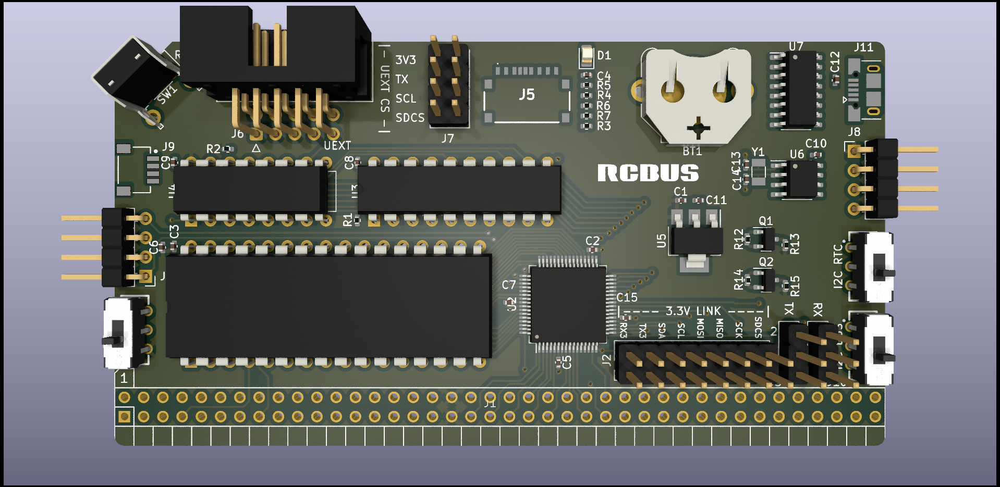

## z80ctrl NG

**Important: This design has not yet been tested.  Manufacture at your own risk.**

This is a new design for z80ctrl using the [Microchip AVR128DB64](https://www.microchip.com/en-us/product/avr128db64) microcontroller. This next-gen AVR has several advantages over the ATmega1284P used in the original design:

- It's a 64-pin part with more than enough I/O to interface with the RC2014 bus without an I/O expander. This will allow much faster data transfers since all signals are accessed in parallel rather than serially.
- It has built-in configurable logic used to assert the wait signal on I/O requests without external glue logic.
- It has multi-voltage I/O where one port can run at 3.3V to interface the SD card and other peripherals directly without level shifters.
- The TQFP package leaves enough space to incorporate 512KB of RAM with optional bank switching and an RTC on the same board.

The disadvantage is that it's a fine-pitched surface mount part, but now that PCB manufacturers offer board assembly service, it is possible to order a board with the surface mount components pre-populated.

### RAM

This board combines features of the original z80ctrl board plus the RAM and RTC from the companion CPU/RAM/RTC board. The CPU remains on a separate board so that z80ctrl can be used with different CPUs.  

The RAM uses the same bank switching scheme as the original board, with two 32K windows into 512K of RAM:
- The active banks for the upper and lower windows are stored in the upper and lower nybbles of a 74HCT574 8-bit register.  
- A 74HCT257 multiplexer selects between the two windows based on state of A15.  
- Bank switching on this board can be disabled via the slide switch, in which case A15 is connected directly to the SRAM and the output of the 74HCT257 is disabled.  
- A16-A18 are connected directly to the bus, so with bank switching disabled, a CPU with more address lines can be used. 
- The AVR is connected to A16-A18 directly as well so it can work with all 512KB of RAM in either mode.
- Instead of using a 74HCT138 decoder to bank register, it is controlled directly by the AVR. The AVR will listen on a configurable I/O port for bank changes from the CPU and update the flip-flop as needed.

The RAM and bank logic chips are still DIPs to keep the retro vibe, and for practical reasons as well:
- Choosing not to populate the RAM and logic chips allows using the z80ctrl as a stand-alone AVR dev board.
- Without these chips populated, all the pins used for A0-A18 and D0-D7 can used as GPIO.
- It should still be possible to use z80ctrl for SBCs like the SC126, which already has RAM and ROM, by leaving the RAM on the z80ctrl unpopulated.

### RTC

The board includes an RTC for accurate timestamps on the files stored on the SD card:

- The chip used is a [Microchip MCP2940N](https://www.microchip.com/en-us/product/mcp7940n) I2C RTC. 
- The bus can be shared with additional I2C peripherals assuming they do not use the same address as the RTC.  
- A slide switch can be used to completely detach the RTC from the SDA and SCL pins so they can  be used as GPIO on the UEXT port.

### UEXT Bus

- The 3-volt SPI, I2C, and UART signals are exposed on the [UEXT header](https://www.olimex.com/Products/Modules/UEXT/). This allows it to interface with many different 3V peripherals using I2C, UART, or SPI. 
- Olimex sells many modules using the UEXT connector as well as adapters for the Sparkfun Qwiic and and Adafruit Stemma QT connectors so that these peripherals can also be used.
- The CS pin is configurable using a slide switch:
  - The same CS as the SD card. In this configuration, the SD card must be removed.
  - The RX or TX pin of the 3V UART. In this configuration, the corresponding direction of the 3V UART is sacrificed.
- The AVR can expose an parallel interface to peripherals over I/O requests on the RCbus.
- If the RTC is disconnected via the 3V I2C slide switche, and the SD card is ejected, the UEXT connector can be used as a 3V 8-bit GPIO port.

### RCBus Optional Connections

- The 5V level-shifted I2C bus can optionally be exposed on USER6 and USER7 pins of the RCbus (selectable via a slide switch). These are the same pins used for I2C by the [SC126](https://smallcomputercentral.com/sc126-z180-motherboard-rc2014/).
- UART signals can be individually connected or disconnected from the RCbus using DIP switches.
- The 5V supply for each separate serial header can be connected or disconnected from the board's power supply:
  - The supply should be disconnected when using a USB-to-serial adapter when the z80ctrl is powered from the RCbus.
  - The supply can be connected to power TTL to RS232 level shifters from the board's supply.
  - When using the board as a stand-alone AVR dev board, you may wish to power it from the USB-to-serial adapter, in which case the supply can be connected.
- Unlike previous versions of z80ctrl, the SPI bus is no longer exposed on the user pins. If desired, a ribbon cable can be used with the UEXT header to connect to SPI peripherals on other boards.